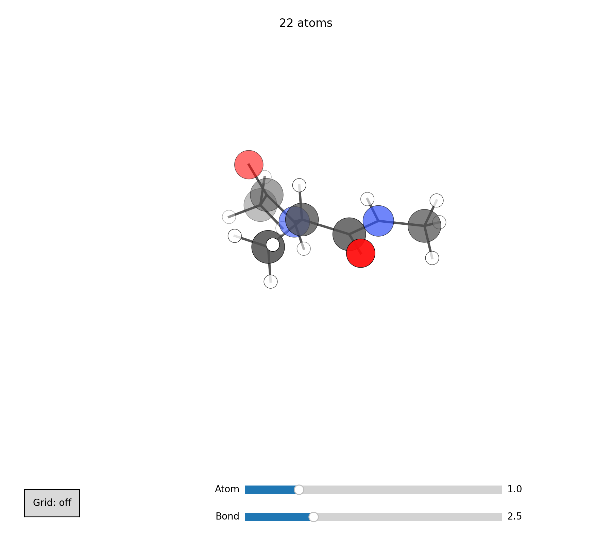
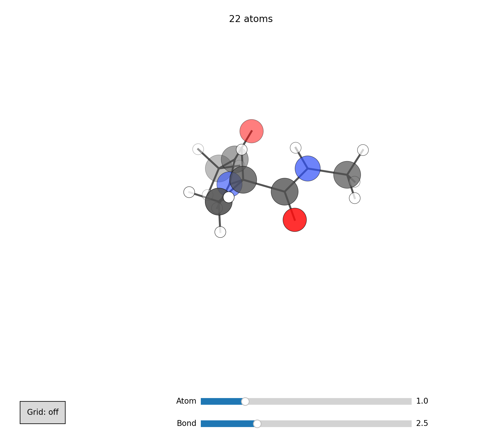
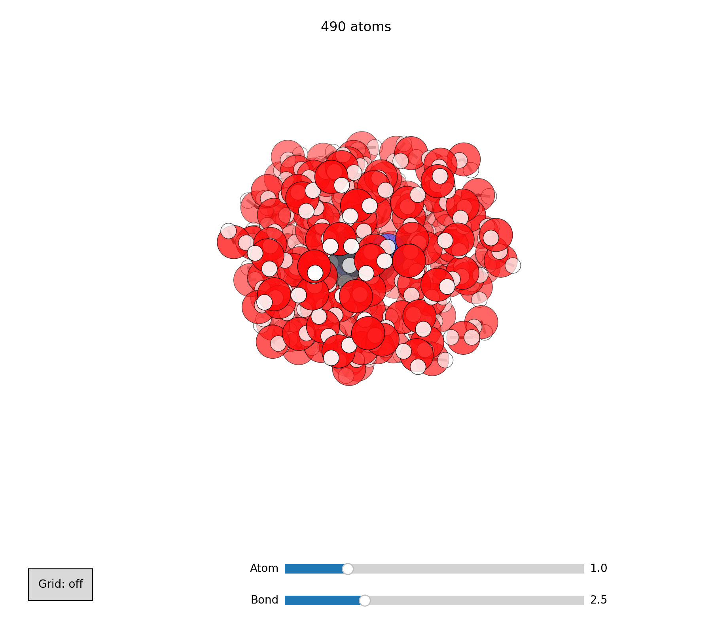
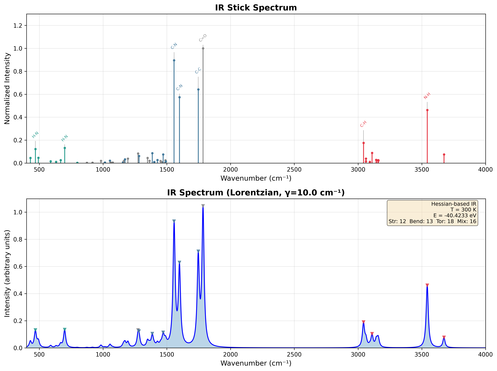
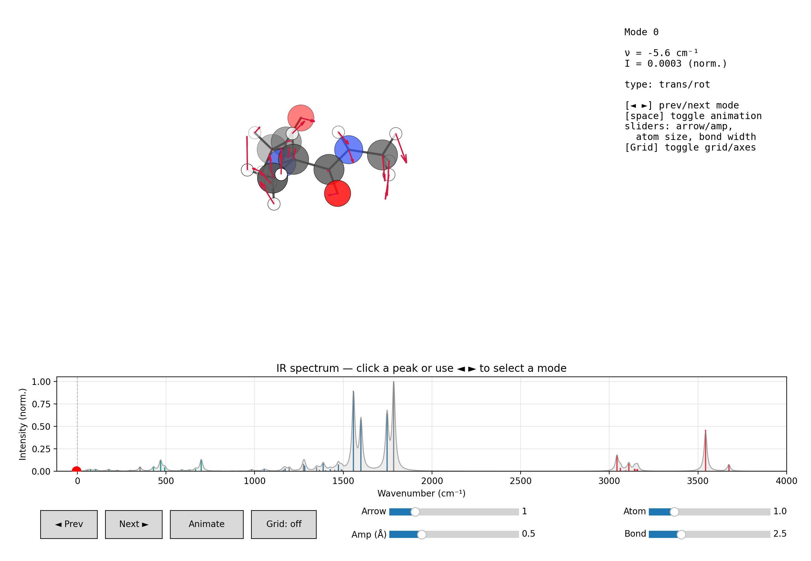

# End-to-end: alanine dipeptide

A complete walkthrough that takes a single molecule —
**alanine dipeptide** (N-acetyl-L-alanine-N′-methylamide, Ace-Ala-NMe) —
through the three core MARS workflows in turn:

1. **Conformational sampling** — find the low-energy backbone conformers.
2. **Microsolvation** — wrap the best conformer in explicit water.
3. **IR spectroscopy** — compute and inspect its vibrational spectrum.

Alanine dipeptide is the textbook model for backbone $(\phi, \psi)$
preferences, which makes it an ideal end-to-end demonstration.

---

## Setup

```bash
cd examples/alanine
python 00_make_structure.py alanine_dipeptide.xyz   # RDKit → starting geometry
```

<figure markdown>
  { width="420" }
  <figcaption><b>Starting structure.</b> Ace-Ala-NMe built from SMILES and
  MMFF-preoptimized. Rendered with <code>mars viewer alanine_dipeptide.xyz --save</code>.</figcaption>
</figure>

---

## 1. Conformational sampling

Run the four-phase search (MTD grid → refinement → multi-temperature MD →
genetic crossing). The `quick` preset keeps the demo fast; use `normal` or
`thorough` for production.

```bash
mars alanine_dipeptide.xyz --mode quick --potential so3lr -o conformers.xyz
python lowest_conformer.py conformers.xyz best.xyz       # global minimum
mars viewer best.xyz --save best_conformer.png
```

The ensemble is written sorted by energy (`conformers.xyz`); the global
minimum is frame 0.

<figure markdown>
  { width="420" }
  <figcaption><b>Lowest-energy conformer.</b> The intramolecular
  C=O···H–N hydrogen bond that stabilizes the backbone is clearly visible.</figcaption>
</figure>

---

## 2. Microsolvation

Wrap the lowest conformer in a shell of explicit water using the geometric
layer-by-layer builder (target 4 Å of solvent padding):

```bash
mars solvation best.xyz --solvent water --padding 4.0 \
    --potential so3lr --output solvated.xyz
mars viewer solvated.xyz --save solvated.png
```

<figure markdown>
  { width="460" }
  <figcaption><b>Explicit solvation.</b> Water placed by Fibonacci-sphere
  candidate generation + van der Waals rejection, then relaxed with the solute
  frozen.</figcaption>
</figure>

!!! tip "Liquid-like packing"
    For denser, droplet-style packing use the barostat builder:
    ```bash
    mars solvation best.xyz --solvent water --barostat --n-molecules 20 \
        --potential so3lr --output solvated_barostat.xyz
    ```

---

## 3. IR spectroscopy

Compute the harmonic spectrum of the lowest conformer, write the annotated
plot, and export the files the interactive viewer reads back:

```bash
mars ir best.xyz --potential so3lr \
    --plot --plot-output ir_spectrum.png --mode-xyz --save-structure
```

<figure markdown>
  { width="640" }
  <figcaption><b>IR spectrum (<code>--plot</code>).</b> Stick spectrum with
  per-mode internal-coordinate labels (top) and the Lorentzian-broadened
  envelope (bottom). The amide I (C=O stretch) and amide II (N–H bend) bands
  are the strong features near 1650–1700 and 1500–1550&nbsp;cm⁻¹.</figcaption>
</figure>

Then explore individual normal modes interactively (or render a snapshot):

```bash
mars viewer --ir --dir .                  # interactive explorer
mars viewer --ir --dir . --save ir_viewer.png   # headless snapshot
```

<figure markdown>
  { width="640" }
  <figcaption><b>Interactive IR explorer (<code>mars viewer --ir</code>).</b>
  3D molecule with per-mode displacement arrows, an info panel
  (frequency / intensity / type), and a clickable spectrum. Step through modes
  with the arrow keys or by clicking a peak.</figcaption>
</figure>

---

## Reproduce everything

One script runs all three stages and regenerates every figure on this page:

```bash
cd examples/alanine
bash 01_run_workflow.sh            # SO3LR (default)
POT=harmonic bash 01_run_workflow.sh   # fast, weight-free smoke test
```

| Script | What it does |
|--------|--------------|
| [`00_make_structure.py`](https://github.com/TCPUniLU/mars/tree/main/examples/alanine/00_make_structure.py) | Build `alanine_dipeptide.xyz` from SMILES (RDKit). |
| [`lowest_conformer.py`](https://github.com/TCPUniLU/mars/tree/main/examples/alanine/lowest_conformer.py) | Extract the global-minimum frame from an ensemble. |
| [`01_run_workflow.sh`](https://github.com/TCPUniLU/mars/tree/main/examples/alanine/01_run_workflow.sh) | Full sampling → solvation → IR run + all snapshots. |

See the per-subcommand pages for the full flag reference:
[conformational search](conformer_search_recipes.md),
[solvation](solvation_recipes.md), and [IR](ir_recipes.md).
