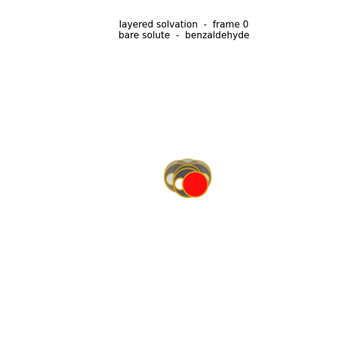
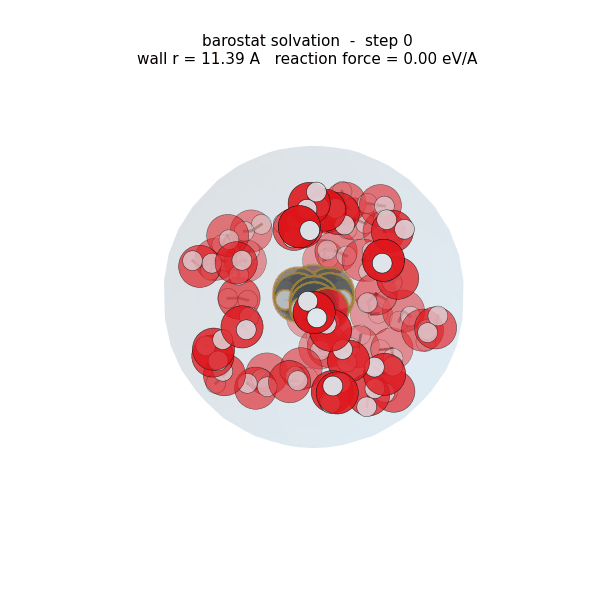

# Solvation recipes

List all built-in solvents first:

```bash
python -c "import mars.solvents; print(mars.solvents.list_solvents())"
```

## Two ways to solvate the same molecule

MARS ships **two independent solvation builders**. Both take the same solute and
solvent — they differ in *how* the solvent is placed and packed. This demo runs
each on the same molecule so you can compare.

=== "1 · Layered (surface packing)"

    The **default** builder. It grows solvent shells outward from the solute
    surface (per-atom Fibonacci-sphere candidates + van der Waals rejection),
    relaxing the solute-frozen cluster after each shell (`--opt-mode layerwise`).
    Great for micro-solvation and a well-defined first shell.

    ```bash
    # Grow water shells until 4 Å of solvent padding, relaxing each shell
    mars solvation solute.xyz --solvent water --padding 4.0 \
        --potential so3lr --opt-mode layerwise --output solvated_layered.xyz

    # Or ask for an exact molecule count instead of padding
    mars solvation solute.xyz --solvent water --n-molecules 30 \
        --potential so3lr --output solvated_layered.xyz
    ```

    <figure markdown>
      { width="420" }
      <figcaption>Layered build — solvent (gold) is packed shell by shell onto the
      benzaldehyde surface (red), relaxing after each shell.</figcaption>
    </figure>

=== "2 · Barostat (droplet compression)"

    Packs a **solute-free solvent droplet** in a spherical shell, compresses it
    with a moving wall (a crude barostat) until the wall reaction force hits
    `--baro-max-force`, then swaps the solute into the cavity. Gives a denser,
    more bulk-liquid-like environment. Requires an explicit `--n-molecules`.

    ```bash
    # Compress a 30-water droplet (harmonic wall), then swap the solute in
    mars solvation solute.xyz --solvent water --n-molecules 30 --barostat \
        --potential so3lr --output solvated_barostat.xyz

    # MD-driven compression so the solvent flows/packs like a liquid
    mars solvation solute.xyz --solvent water --n-molecules 30 --barostat \
        --baro-md --baro-md-temp 300 --baro-md-time 0.3 \
        --potential so3lr --output solvated_barostat.xyz
    ```

    <figure markdown>
      { width="420" }
      <figcaption>Barostat build — a solute-free solvent droplet (red) is compressed
      by the moving spherical wall; the reaction force rises as it packs, then the
      solute is swapped into the central cavity.</figcaption>
    </figure>

**Which one?**

| | Layered (`--opt-mode layerwise`) | Barostat (`--barostat`) |
|---|---|---|
| Placement | outward from the solute surface, shell by shell | pre-packed droplet, compressed onto the solute |
| Target | `--padding`, `--n-molecules`, or `--layers` | `--n-molecules` (required) |
| Packing density | well-defined shells, relaxed per layer | denser, bulk-liquid-like |
| Best for | micro-solvation, first-shell studies | droplet / condensed-phase-like environments |
| Multi-conformer | `--all-conformers` (re-solvate each frame) | `--solute-swap` (build once, transplant + batch-pack) |

Both write a standard XYZ you can view or feed straight into `mars ir` /
`mars optimize`:

```bash
mars viewer solvated_layered.xyz --save layered.png
mars viewer solvated_barostat.xyz --save barostat.png
```

See the [solvation guide](../guide/solvation.md) for the full mechanics of each
builder; the sections below are a flag-by-flag reference.

## Automatic shell growth

```bash
# Grow water shells until 5 Å padding is reached
mars solvation solute.xyz --solvent water --padding 5.0

# Keep exactly 30 molecules (dense fill, trimmed to the 30 closest)
mars solvation solute.xyz --solvent water --n-molecules 30

# Cap the number of auto-generated shells (safety stop)
mars solvation solute.xyz --solvent water --padding 5.0 --max-layers 6
```

## Manual layer counts

```bash
# One shell of 6 waters
mars solvation solute.xyz --solvent water --layers 6

# Two-shell methanol solvation (4 + 8)
mars solvation solute.xyz --solvent methanol --layers 4 8

# Three-shell solvation with explicit per-layer counts
mars solvation solute.xyz --solvent water --layers 6 12 18
```

## Optimization strategy

```bash
# DEFAULT: iterative fill → relax → refill until the shell is saturated
mars solvation solute.xyz --solvent water            # --opt-mode layerwise (default)

# Placement only — fastest, no energy minimization (no potential needed)
mars solvation solute.xyz --solvent water --opt-mode none

# Fill all shells, then relax everything once
mars solvation solute.xyz --solvent water --padding 5.0 --opt-mode after-all

# HYBRID optimizer (FIRE coarse → LBFGS fine)
mars solvation solute.xyz --solvent water --padding 5.0 --opt-mode layerwise --method HYBRID
```

## Topology repair (post-relaxation integrity)

```bash
# DEFAULT: broken solvent molecules (fragmented/reacted during relaxation) are
# removed, refilled to the target, and re-relaxed until none are broken.
mars solvation solute.xyz --solvent ether --n-molecules 40

# Allow more repair passes and a looser break threshold
mars solvation solute.xyz --solvent ether --n-molecules 40 --max-repair 5 --topo-tolerance 1.4

# Disable the check entirely (keep whatever relaxation produced)
mars solvation solute.xyz --solvent ether --n-molecules 40 --no-topology-repair
```

## Barostat droplet (spherical moving-wall) mode

```bash
# Pack a solvent droplet and compress it (harmonic wall) until the wall
# reaction force hits 1.0 eV/Å, then swap the solute into the cavity.
mars solvation solute.xyz --solvent ether --n-molecules 40 --barostat

# Stiffer wall, higher target "pressure", finer compression steps
mars solvation solute.xyz --solvent water --n-molecules 60 --barostat \
    --baro-wall-mode wall --baro-max-force 2.0 --baro-step 0.3 --baro-k 10.0

# Bigger cavity / looser start, explicit initial outer radius
mars solvation solute.xyz --solvent acetonitrile --n-molecules 50 --barostat \
    --baro-inner-buffer 3.0 --baro-radius 18.0 --baro-max-steps 60

# Build one compressed droplet and transplant it across all conformers
mars solvation ensemble.xyz --solvent ether --n-molecules 40 --barostat \
    --solute-swap --conformer 0

# MD-driven compression: short NVT (wall in the energy) at each step so the
# solvent flows/packs like a liquid, then a FIRE settle.
mars solvation solute.xyz --solvent water --n-molecules 60 --barostat \
    --baro-md --baro-md-temp 300 --baro-md-time 0.3
```

## Aliases

```bash
# All resolve through the solvent library
mars solvation solute.xyz --solvent DCM --layers 6
mars solvation solute.xyz --solvent EtOH --padding 4.0
mars solvation solute.xyz --solvent DMSO --n-molecules 20
mars solvation solute.xyz --solvent hexane --layers 8
```

## Your own solvent

Pass a path to a single-molecule `.xyz` instead of a library name — anything
ending in `.xyz` / existing on disk is loaded as a custom solvent:

```bash
mars solvation solute.xyz --solvent ./propylene_carbonate.xyz --padding 5.0
mars solvation solute.xyz --solvent /data/solvents/my_ionic_liquid.xyz --layers 6
```

## Multi-conformer

```bash
# Independent solvation of every frame in a multi-frame XYZ
mars solvation ensemble.xyz --solvent water --padding 5.0 --all-conformers

# Transplant the same shell across an ensemble (faster, less variance)
mars solvation ensemble.xyz --solvent water --padding 5.0 \
    --solute-swap --conformer 0

# N independent solvation replicas with different seeds (averaged ensemble)
mars solvation solute.xyz --solvent water --layers 6 --n-solvations 4 --seed 42
```

## Placement tuning

```bash
# Custom Fibonacci candidates + radial shells (more candidates → better packing)
mars solvation solute.xyz --solvent acetonitrile --layers 6 \
    --n-candidates 500 --n-shells 4 --vdw-scale 0.75 --buffer 0.3
```

## Driving from a config file

```toml
# solv.toml
[solvation]
solvent = "water"
layers = [4, 8]
opt_mode = "layerwise"
method = "FIRE"
fmax = 0.05
vdw_scale = 0.75
seed = 42
output = "solvated.xyz"

[global]
charge = 0.0
```

```bash
mars solvation solute.xyz --config solv.toml
```

For automatic mode, replace `layers = [...]` with one of:

```toml
padding = 5.0               # grow shells until ≥5 Å padding
# or
n_molecules = 30            # keep exactly 30 solvent molecules
```

## Python API

```python
from mars import load_structure, auto_solvate, solvate
from mars.solvents import list_solvents, get_solvent, load_solvent, register_solvent

print(list_solvents())                       # all built-in solvents
print(get_solvent("water")["formula"])       # → H2O

solute = load_structure("solute.xyz")

# Automatic solvation
solvated = auto_solvate(
    solute,
    solvent="water",
    padding=5.0,
    potential_name="so3lr",
    optimise_each_layer=True,
)

# Manual layers
solvated = solvate(solute, solvent="methanol", layers=[4, 8])

# Use your own solvent geometry directly — `solvent=` accepts a library name,
# a path to an .xyz, or a {"symbols", "positions"} dict.
solvated = solvate(solute, solvent="./propylene_carbonate.xyz", layers=[6, 12])

# `load_solvent` resolves a name/alias OR a file path to a solvent entry
my_pc = load_solvent("./propylene_carbonate.xyz")   # source == "user-file"
water = load_solvent("EtOH")                          # library alias

# Register a custom solvent under a name + metadata for repeated use
register_solvent(
    "my_pc",
    "/path/to/propylene_carbonate.xyz",
    formula="C4H6O3",
    density=1.21,
    dielectric=66.1,
    aliases=["pc"],
)
solvated = solvate(solute, solvent="pc", layers=[6])
```

See also: [User guide](../guide/solvation.md),
[CLI reference](../cli/solvation.md),
[`mars.solvation`](../api/solvation.md),
[`mars.solvents`](../api/solvents.md).
