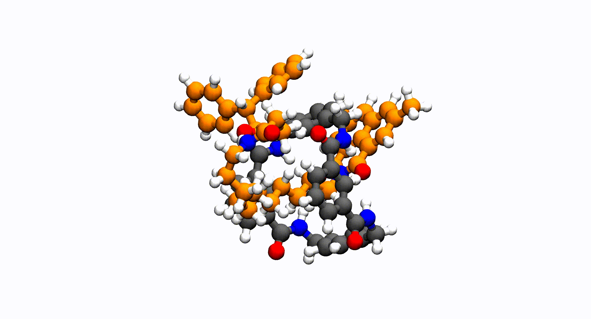

# Conformational search

The default `mars input.xyz` mode runs a RMSD-biased metadynamics
workflow inspired by the algorithmic ideas in CREST (Pracht, Bohle &
Grimme, PCCP 2020). MARS is an independent JAX/ML-potential
reimplementation — there is no shared code — but the high-level
sampling logic follows the same four-stage structure:

1. **Multi-step MTD** — several biased MD trajectories with different
   `(kpush, alpha)` parameter pairs to map the configurational space.
2. **Rotamer MD** — short unbiased MD at multiple temperatures from the
   most diverse minima found in step 1.
3. **Optional genetic crossing** (`--genetic-crossing`) — Z-matrix
   combinatorial recombination of low-energy parents.
4. **Pruning** — RMSD + energy-window + topology-aware filtering to
   produce the final ensemble.

All parameters auto-tune from the molecular flexibility, computed from
covalent topology, sp²/sp³ hybridization, and rotatable-bond count (see
[`mars.flexibility`](../api/flexibility.md) — a Python flexibility
metric whose factor decomposition draws on the same physical reasoning
as CREST's original formulation).

<figure markdown>
  { width="480" }
  <figcaption>A MARS conformational sample of a rotaxane spanning ~10 kcal/mol.
  Initial structure from <em>J. Am. Chem. Soc.</em> 2004, 126, 12636–12645.</figcaption>
</figure>

## Modes

| Flag         | Effective settings                                |
|--------------|---------------------------------------------------|
| `--quick`    | 1 MTD cycle, short rotamer MD, no crossing        |
| `--mode normal` *(default)* | 2 MTD cycles, default rotamer MD   |
| `--thorough` | 3+ MTD cycles, longer rotamer MD, more replicas   |

Override individual parameters as needed — see the
[CLI reference](../cli/conformer_search.md).

## Workflow variants

| Flag | What it disables |
|------|------------------|
| `--mtd-only` | Skip rotamer MD and genetic crossing |
| `--md-only`  | Drop the metadynamics bias too — plain NVT MD |

These are useful for diagnostics (`--md-only` to verify the integrator)
or for very rigid molecules where the rotamer phase is wasted.

## Multi-fragment / non-covalent systems

For host–guest complexes, ion pairs, and solvated solute–solvent setups,
add `--nci` to apply a spherical confinement potential during all
sampling stages and suppress the "multiple fragments detected" warning.
See [NCI mode](nci_mode.md) for details.

## Choosing the optimizer

The workflow runs **many** local optimizations: an initial relaxation
of the input geometry, then a 3-cycle multilevel ladder (coarse →
medium → fine) after each sampling phase. All cycles share the same
optimizer, configurable through:

- `--method {LBFGS, FIRE, GD, SP}` — defaults to `LBFGS` (jaxopt
  L-BFGS, recommended for smooth ML potentials). `FIRE` (jax-md) is
  robust when forces are noisy (e.g. dxtb pure callbacks); `GD` is
  occasionally useful as a sanity-check; `SP` runs a damped-Newton
  stationary-point search — usually too aggressive for conformer
  enumeration, prefer `mars optimize --task stationary` if that is
  your actual goal.
- `--fmax eV/Å` — overrides the auto-derived **final-cycle** force
  threshold from `--optlevel`. Coarse pre-cycles stay scaled at 50×
  and 10× the final value so you only set the *fine* convergence and
  the ladder follows.
- `--maxiter`, `--max-stepsize` — apply only to the final cycle.
  Coarse pre-cycles keep their hardcoded budgets (10 / 100 iterations
  and 1.0 Å / 0.5 Å step caps).
- `--fire-dt-start`, `--fire-dt-max`, `--fire-n-min` — only consulted
  when `--method FIRE`.

```bash
mars input.xyz --method FIRE
mars input.xyz --method GD --max-stepsize 0.05
mars input.xyz --method LBFGS --fmax 0.005 --maxiter 2000
```

The same exact flags work in `mars optimize` for standalone
relaxation; here they additionally drive every optimization step
*inside* the sampling workflow.

## See also

- [Recipes](../examples/conformer_search_recipes.md) — copy-pasteable
  command lines for every common scenario.
- [`[conformer_search]` config section](../config/conformer_search_section.md).
- API reference: [`mars.conf_sampling`](../api/conf_sampling.md),
  [`mars.sampling`](../api/mtd.md), [`mars.mtd`](../api/mtd.md),
  [`mars.flexibility`](../api/flexibility.md).
