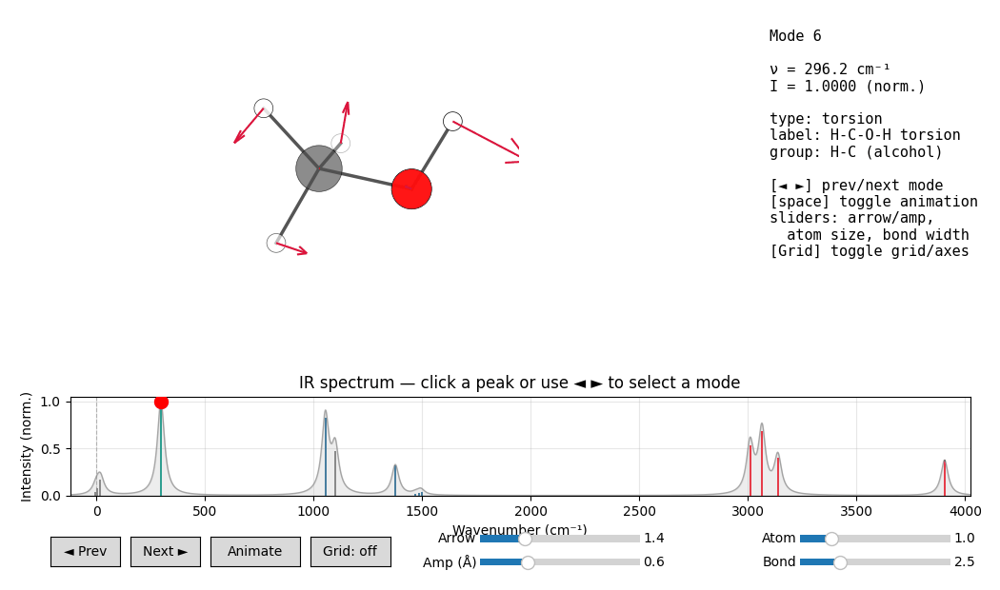

# IR spectroscopy

`mars ir input.xyz` computes infrared spectra by one of three methods:

## 1. Analytical Hessian (default)

JAX automatic differentiation gives the exact 3N×3N mass-weighted Hessian
of the chosen potential. Eigendecomposition yields normal modes and
frequencies; IR intensities come from partial-charge dipole derivatives
(currently SO3LR is the only built-in potential that provides charges).

```bash
mars ir input.xyz --plot
```

Recommended for small to medium molecules. Cheap and exact.

## 2. Finite-differences Hessian

When autodiff is numerically unstable (rare; usually only for non-smooth
potentials), step the gradient by `--fd-displacement` Å in each Cartesian
direction:

```bash
mars ir input.xyz --fd-hessian --fd-displacement 0.01 --plot
```

## 3. MD-based dipole autocorrelation

Run NVT equilibration + NVE production, save the dipole moment along the
trajectory, Fourier-transform the autocorrelation function. More expensive
but captures anharmonicity and finite-temperature effects:

```bash
mars ir input.xyz --md --nvt-time 5 --nve-time 25 --n-replicas 4 --plot
```

Multiple replicas (different random seeds) and segment averaging (`--chop`)
improve statistics. Requires a potential that provides partial charges.

## Peak allocation

When `--save-hessian` and the default `--no-no-analysis` are active, each
mode is assigned to the closest functional group via AccFG-style graph
matching (see [`mars.functional_groups`](../api/functional_groups.md)).
The output `mode_analysis.txt` lists each mode's dominant atoms and the
associated FG label (e.g. `C=O (ketone)`, `O-H (alcohol)`).

## Multi-conformer

For an ensemble XYZ:

- `--conformer N` — pick a single conformer (0-indexed).
- `--all-conformers` — compute IR for every frame; per-conformer files
  use the `--output-prefix` template.

## Partial-system IR (`--atoms`)

For systems with more than one molecule — a solute embedded in explicit
solvent, an ion pair, a host–guest complex — you usually only want the
IR signature of one fragment. The `--atoms` flag restricts the
calculation to a 0-based subset of the input atoms.

```bash
mars ir solvated.xyz --atoms 0-8 --plot            # solute = atoms 0..8
mars ir solvated.xyz --atoms "0-2,15"              # noncontiguous subset
mars ir solvated.xyz --atoms 0-8 --md --plot       # partial dipole in MD
```

Accepted forms: CSV (`0,1,2`), range (`0-5`), mixed (`0-3,7,10-12`),
or whitespace-separated tokens (`0-3 7 10-12`). The same parser is
shared with the `[constraints]` config section.

**Hessian path.** Only the selected atoms are displaced when building
the Hessian — the forces and partial charges still see the full system.
The resulting matrix is `3K × 3K` (`K = len(atoms)`), diagonalized in
the selected subspace. Geometry optimization (if not disabled with
`--no-optimize`) still relaxes the full system before the Hessian is
built, so the partial Hessian reflects the selected atoms vibrating
against a relaxed environment.

**MD path** (`--md`). The dynamics run on the full system; the dipole
tracked at every saved step is

```
μ(t) = Σ_{i ∈ atoms} q_i(t) · r_i(t)
```

so the autocorrelation Fourier transform captures only the IR signal
from the selected subsystem (e.g. the solute's response, with the
solvent providing the dynamical environment).

The Python API exposes the same selection through an `atom_indices`
keyword:

```python
from mars.ir import compute_ir_spectrum

# Partial Hessian over the first nine atoms
result = compute_ir_spectrum(
    "solvated.xyz",
    potential_name="so3lr",
    atom_indices=[0, 1, 2, 3, 4, 5, 6, 7, 8],
)

# The result keys positions / symbols / masses / numbers / charges refer
# to the selected subset; full_positions / full_symbols / full_numbers /
# full_masses / full_charges hold the entire structure, and atom_indices
# records the selection itself.
```

## Exploring results interactively

Once you have run an analytical-Hessian calculation with `--mode-xyz`
(and `--plot` for intensities), explore the modes interactively with
[`mars viewer --ir`](../cli/viewer.md): a rotatable 3D molecule with per-mode
displacement arrows and an oscillation animation, an info panel showing the
frequency / intensity / classification, and a clickable IR spectrum with a
marker on the selected mode.

```bash
mars ir input.xyz --mode-xyz --save-structure --plot
mars viewer --ir              # auto-discovers the result files
```

<figure markdown>
  { width="720" }
  <figcaption>The IR explorer on methanol — stepping through the strongest modes,
  each with its displacement arrows, oscillation, info panel, and the matching
  peak highlighted on the spectrum.</figcaption>
</figure>

## See also

- [`mars viewer`](../cli/viewer.md) — interactive IR / molecule / NCI viewer.
- [Recipes](../examples/ir_recipes.md).
- [`[ir]` config section](../config/ir_section.md).
- API reference: [`mars.ir`](../api/ir.md),
  [`mars.functional_groups`](../api/functional_groups.md).
