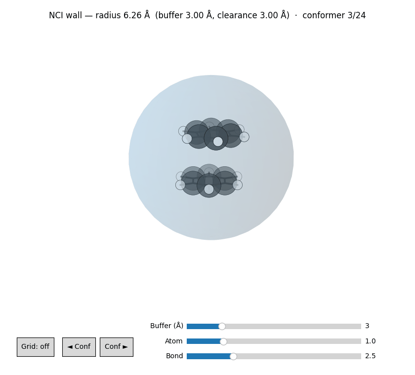

# NCI mode

For multi-fragment, non-covalently bound systems — host–guest complexes,
ion pairs, solute–solvent clusters, hydrogen-bonded dimers — MARS can
apply a spherical confinement potential during every MTD/MD run and
suppress the "multiple molecules detected" warning.

## Why

Without confinement, biased MD on a weakly bound complex tends to drift
into dissociation: the metadynamics bias pushes fragments apart faster
than the intermolecular attraction can pull them back together. The
confinement potential keeps every atom inside a sphere whose radius is
set from the initial geometry plus `--nci-buffer`.

## Usage

```bash
# Soft polynomial wall (default)
mars complex.xyz --nci --nci-buffer 3.0

# Harder harmonic restraint
mars complex.xyz --nci --nci-mode harmonic

# Reject snapshots where fragments drift further apart than 4 Å beyond
# their initial closest contact
mars complex.xyz --nci --nci-max-dist 4.0
```

## Flags

| Flag | Default | Notes |
|------|---------|-------|
| `--nci` | off | Enable NCI mode (turns on the confinement, disables the multi-fragment warning) |
| `--nci-mode {wall,harmonic}` | `wall` | Polynomial wall (hard) or quadratic restraint (soft) |
| `--nci-buffer Å` | 3.0 | Extra distance beyond the outermost atom |
| `--nci-max-dist Å` | 3.0 | Maximum drift beyond the initial closest inter-fragment contact before a snapshot is discarded |

## Visualising the confinement sphere

Before committing to a buffer, preview the wall with the
[`mars viewer`](../cli/viewer.md) tool:

```bash
mars viewer complex.xyz --nci                 # default buffer (3.0 Å)
mars viewer complex.xyz --nci --nci-buffer 5.0
```

The molecule is drawn inside a translucent sphere, and the centre, radius,
buffer, and closest atom-to-wall clearance are printed so you can judge whether
to increase `--nci-buffer`. The viewer mirrors the solver exactly: positions are
centred by their **centroid**, the wall is anchored at the **origin**, and the
radius is `max(|rᵢ|) + buffer`. A **Buffer (Å)** slider resizes the wall live,
and for a multi-frame input the ◄/► buttons (or arrow keys) step through
conformers — each independently centred with its own wall.

<figure markdown>
  { width="620" }
  <figcaption><code>mars viewer --nci</code> on a benzene dimer, stepping through
  relative arrangements (sandwich → parallel-displaced → T-shaped) inside the
  spherical confinement wall.</figcaption>
</figure>

## See also

- CLI reference: [`mars viewer`](../cli/viewer.md) — interactive wall preview.
- API reference: [`mars.potentials.ConfinementPotential`](../api/potentials.md).
